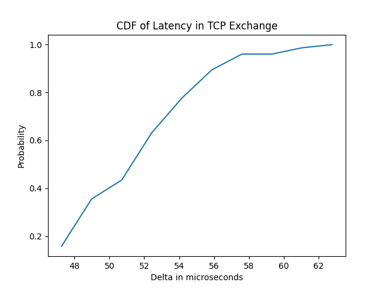

Wed Oct 21 2020

Nuru Nabiyev 2642819

Matthias Debernardini 2622050

Det Shahu 2611771

# Milestone 5 for Userspace TCP Stack

To understand how benchmarks are done we were tasked with doing one so that we can see the
difficulties that come from trying to clock a computer system. 

The first step involved choosing the platofrm to run the benchmark on. For that we decided to use a
PC with the following specifications; AMD Ryzen 2700x, 16 GB of 3200MHz CL14 DDR4 RAM, 120GB SATAIII
SSD running Ubuntu 18.04.5 LTS. All samples were taken from this machine consecutively. The second
step involved choosing how to query the system clock. For this we picked the monotonic clock in the time library that ships
with the linux kernel. We chose to use a wall clock rather than a user clock becuase we are
interested in how the application uses the userspace library rather than how the CPU executes the
code. The next step was deciding where to start the time and when to end it. We were interested in
measring the latency that occurs in the 3 way TCP handshake. To measure this, we placed the clocks
in the client applications at the begining and at the end of the exchange. Nothing was changed
neither in the application nor in the userspace library. The difference between the clocks was
printed to standard output, which is then redirected to a file with a timestamp of the sample. The
code can be found in the appendix. The server and client were then ran multiple times.

Once we collected the data, we had to decide which samples were actually representative of the
actual latency between the server and the client. It is unfortunetly insufficent to just measure the
time and then report one quantity. The enviroment that the code is running in is constantly
changing, cache lines are invalidated at seemingly random intervals, the clock frequency is dynamically
changing depending on the load (to increase energy effiency and overall performance), pagefaults
can occur (or not). This is too much information to try to distill into one number. Therefore, to
really estimate the run-time of the exchange, we must also report the median of a
population sample, the standard deviation and the uncertainty.

Becuase of how wildly variable the latency can be, outliers will need to be methodically dealt with.
Our method for dealing with outliers is involves calculating the Median-Absolute-Deviation, using
the MAD to decide if a data point is an outlier. This step included deciding how many deviations
away from the median we tolerate. In our case it was 3, this was chosen manually by
increasing the amount of deviations and seeing when the changes in the number of outliers was small
relative to the number of samples. The uncertainty was then calculated by dividing the MAD by the
square root of non outlier values

| Statistic            | Nanoseconds |
|----------------------|:-----------:|
| Average Latency      |    51136    |
| Median Latency       |    52665    |
| 95 Percentile        |    55601    |
| 99 Percentile        |    61627    |
| Max Observed Latency |    62051    |
| Min Observed Latency |    43060    |
| Uncertainty          |     461     |
| Sample Size          |     74      |


Uncertainty 461
Average 51136
Median 52665
Max Observed 62051
Min Observed 43060
95%% percentile: 55601
99%% percentile: 61627



```
    /* measure monotonic time */
    uint64_t delta;
    struct timespec start, end;
    clock_gettime(CLOCK_MONOTONIC, &start); /* mark start time */

    /* send test buffer */
    while (so_far < TEST_BUF_SIZE) {
        ret = send(server_fd, tx_buffer + so_far, TEST_BUF_SIZE - so_far, 0);
        if (0 > ret) {
            printf("Error: send failed with ret %d and errno %d \n", ret, errno);
            return -ret;
        }
        so_far += ret;
        printf("\t [send loop] %d bytes, looping again, so_far %d target %d \n", ret, so_far, TEST_BUF_SIZE);
    }

    printf("OK: buffer sent successfully \n");
    printf("OK: waiting to receive data \n");
    // receive test buffer
    so_far = 0;
    while (so_far < TEST_BUF_SIZE) {
        ret = recv(server_fd, rx_buffer + so_far, TEST_BUF_SIZE - so_far, 0);
        if (0 > ret) {
            printf("Error: recv failed with ret %d and errno %d \n", ret, errno);
            return -ret;
        }
        so_far+=ret;
        printf("\t [receive loop] %d bytes, looping again, so_far %d target %d \n", ret, so_far, TEST_BUF_SIZE);
    }
    clock_gettime(CLOCK_MONOTONIC, &end);    /* mark the end time */

    delta = BILLION * (end.tv_sec - start.tv_sec) + end.tv_nsec - start.tv_nsec;
    printf("<<BENCHMARK>> %llu\n",(long long unsigned int) delta);
```

# Reproducing the results

+ Install `just` to expedite the benchmark otherwise copy and paste the commands found in the
  `justfile` directly in the shell

+ `just prep`

+ `just benchmark`

+ `cd plotter`

+ `python3 main.py`


http://blogs.perl.org/users/steffen_mueller/2010/09/your-benchmarks-suck.html

